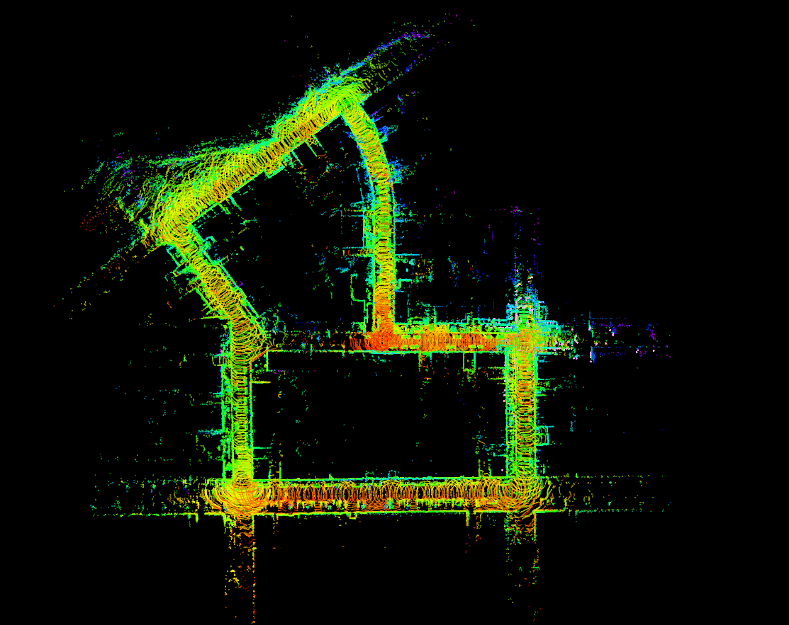

# global-LeGO-LOAM

It contains LeGO-LOAM mapping algorithm and Particle filter localization algorithm.
To find robot pose, map should be built first by LeGO-LOAM. For computation efficiency, all nodes are implemented as nodelet. 

### Preparation
```
cd src && git clone https://github.com/haeyeoni/global-LeGO-LOAM
cd .. && catkin_make
```

### Build map (Using KITTI dataset)
(0) Download KITTI dataset and make as bag file format [(Reference lik)](https://github.com/haeyeoni/lidar_slam_evaluator)

(1) Mapping
```
roslaunch lego_loam kitti_mapping.launch
(new terminal) rosbag play kitti.bag --clock
```
In the launch file, you can set map and key pose path. Model is for generating descriptors and is used for finding initial pose of Monte Carlo Localization. 

* Result map
<p align='center'>
    
</p>


(2) Localization

```
roslaunch lego_loam kitti_localization.launch
(new terminal) rosbag play kitti.bag --clock
```
The argument paths (model_path, feature_cloud_path, key_pose_path, map_save_path) should be set same as the mapping.

* Result 
<p align='center'>
    
</p>


